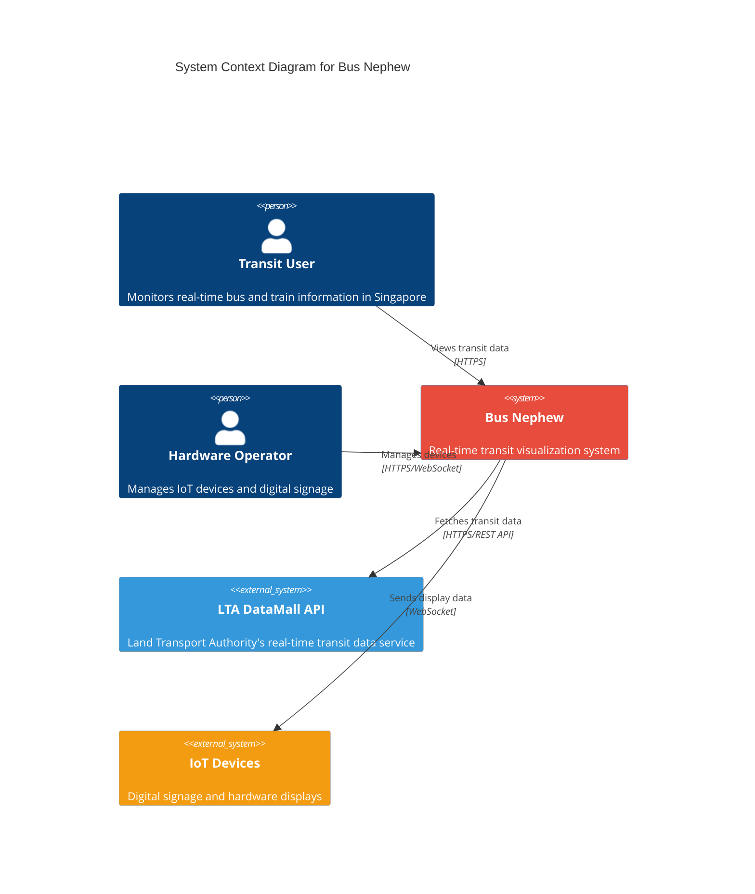
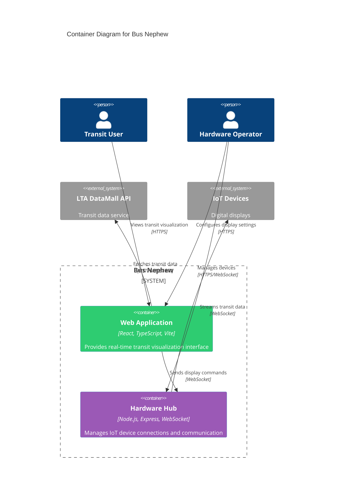
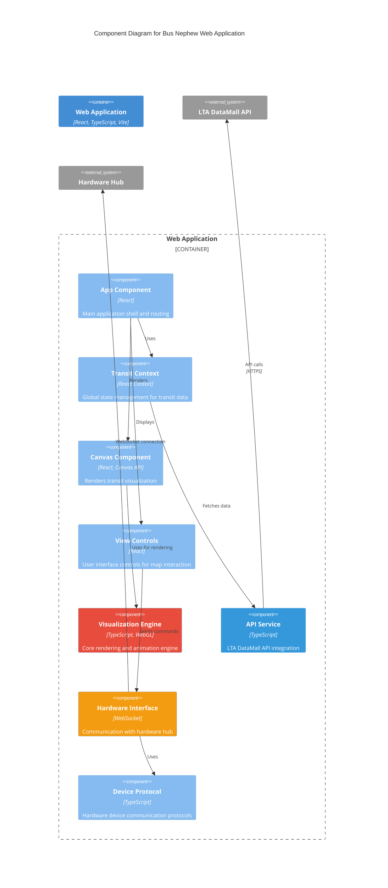
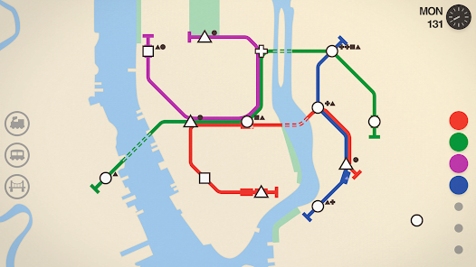

[](https://github.com/gongahkia/bus-nephew/releases/tag/1.0.0)

# `Bus Nephew`

Interactive real-time transit visualization tool that displays [buses](https://www.lta.gov.sg/content/ltagov/en/getting_around/public_transport/bus_services.html) and [trains](https://www.lta.gov.sg/content/ltagov/en/getting_around/public_transport/rail_network.html) in Singapore using Live [LTA DataMall APIs](https://datamall.lta.gov.sg/content/datamall/en.html).

Made mainly to learn [this stack](#stack). My takeaways can be found [here](#takeaways).

## Stack

* *Frontend*: [React](https://reactjs.org/), [TypeScript](https://www.typescriptlang.org/), [Vite](https://vitejs.dev/)
* *Rendering*: [Canvas](https://developer.mozilla.org/en-US/docs/Web/API/Canvas_API), [WebGL](https://developer.mozilla.org/en-US/docs/Web/API/WebGL_API)
* *Backend*: [Node.js](https://nodejs.org/), [Express](https://expressjs.com/), [WebSocket](https://developer.mozilla.org/en-US/docs/Web/API/WebSockets_API)
* *APIs*: [LTA DataMall](https://datamall.lta.gov.sg/content/datamall/en.html)
* *State*: [React Context](https://reactjs.org/docs/context.html)
* *Testing*: [Jest](https://jestjs.io/), [React Testing Library](https://testing-library.com/docs/react-testing-library/intro/)

## Usage

> [!IMPORTANT]
> You need an LTA DataMall API key. Register [here](https://datamall.lta.gov.sg/content/datamall/en.html).

The below instructions are for locally hosting `Bus Nephew`.

1. Execute the below.

```console
$ git clone https://github.com/gongahkia/bus-nephew && cd bus-nephew
```

2. Create `.env` at the project root with your API credentials.

```env
VITE_LTA_API_KEY=your_lta_datamall_api_key_here
VITE_LTA_BASE_URL=http://datamall2.mytransport.sg/ltaodataservice
VITE_API_POLLING_INTERVAL=30000
```

3. Install dependencies and start development server.

```console
$ npm install
$ npm run dev
```

4. Open `http://localhost:5173` in your browser.

## Architecture

### System Context Diagram



### Container Diagram



### Component Diagram (Web Application)



## Features

* **Real-time Visualization**: Live bus and train tracking using LTA DataMall APIs
* **Mini Metro Design**: Minimalist animated schematic with geometric vehicle representations
* **Dual Views**: Toggle between 2D top-down and isometric perspectives
* **Hardware Integration**: WebSocket system for IoT devices and digital signage
* **Interactive Controls**: Zoom, pan, route filtering, and area focus
* **Performance Optimized**: Canvas/WebGL rendering with smooth animations

## Hardware Integration

Enable hardware device support by starting the optional backend:

```console
$ cd backend
$ npm install
$ npm run dev
```

Update frontend `.env`:

```env
VITE_ENABLE_HARDWARE_INTEGRATION=true
VITE_HARDWARE_WEBSOCKET_URL=ws://localhost:3001
```

Example device registration:

```typescript
const config = {
  deviceName: 'Bus Stop Display #1',
  deviceType: 'display',
  capabilities: ['transit_display', 'notifications'],
  location: {
    lat: 1.3521,
    lng: 103.8198,
    description: 'Raffles Place MRT Station'
  }
};
```

## Testing

```console
$ npm test              # Run all tests
$ npm run test:watch    # Watch mode
$ npm run test:coverage # With coverage
```

## Deployment

### Production Build

```console
$ npm run build
```

### Docker

```dockerfile
FROM node:20-alpine
WORKDIR /app
COPY package*.json ./
RUN npm ci --only=production
COPY dist ./dist
EXPOSE 3000
CMD ["npm", "start"]
```

## API Integration

The application uses several LTA DataMall endpoints:

* **Bus Arrival**: Real-time bus arrival information
* **Bus Routes**: Service route information
* **Bus Stops**: Stop locations and details
* **Train Alerts**: MRT/LRT service disruptions

## Takeaways

* Canvas API and WebGL provide smooth real-time rendering for hundreds of transit vehicles with minimal performance overhead.
* React Context proves effective for managing complex transit state across multiple visualization components without prop drilling.
* WebSocket architecture enables seamless hardware integration for IoT devices and digital signage displays.
* LTA DataMall's consistent API structure makes it straightforward to expand from bus data to include trains and other transit modes.

## Legal Disclaimer

### For Informational Purposes Only

Bus Nephew provides transit information for educational and informational purposes only. While every effort is made to ensure accuracy, Bus Nephew makes no guarantees about the completeness or reliability of the information presented.

### Data Sources

All transit data is sourced from the Land Transport Authority Singapore's DataMall APIs. Bus Nephew is not affiliated with LTA and does not control the accuracy of the source data.

### Use at Your Own Risk

Users access and rely on Bus Nephew at their own risk. Transit information may become outdated without notice, and service conditions may change rapidly. Bus Nephew disclaims liability for any inconvenience or issues arising from reliance on the information provided.

### Hardware Integration

Hardware integration features are provided as-is for educational and experimental purposes. Users are responsible for ensuring proper setup and safe operation of any connected devices.

## Reference

`Bus Nephew`'s Web App display was largely inspired by [Mini Metro](https://dinopoloclub.com/games/mini-metro/)'s minimalist design.

<div align="center">
  
</div>

## Contact

This project is created and maintained by Gabriel Ong. Please contact him at [gabrielzmong@gmail.com](mailto:gabrielzmong@gmail.com).